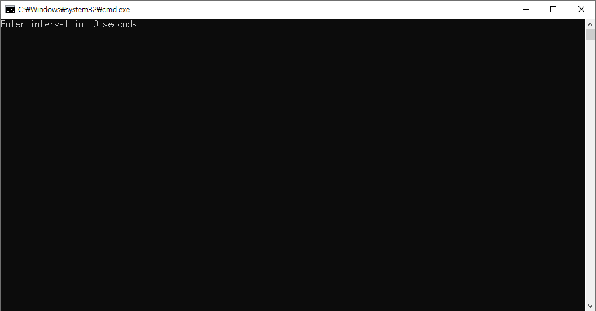

# MoveMouse

## 프로젝트 개요

* 일정 시간 가격으로 마우스가 자동으로 움직이도록 한다.
* 긴 시간이 소요되는 프로세스를 수행할 때 화면 보호기로 인해 동작이 멈추는 것을 방지한다.

## 사용 방법

**# 실행을 위해 JDK 11 필요**
1. [export 경로](https://github.com/yhoo0094/MoveMouse/tree/main/MoveMouse/export)에서 mm.bat, mm.jar 파일 다운로드 

2. mm.bat, mm.jar 파일은 같은 경로에 두고 mm.bat를 실행한다.

3. 마우스 움직이기 수행 간격을 입력한다. 10초 내로 입력하지 않을 경우 기본 값(60초)이 적용된다.

## 개발환경

* IDE: Eclipse 2022-09
* JDK: OpenJDK 11

#### 참고

* [User input with a timeout in Java - stackoverflow](https://stackoverflow.com/questions/61807890/user-input-with-a-timeout-in-java)

* [자바 전체해상도(화면크기) 구하기](https://m.blog.naver.com/onlywin7788/140115953045)

* [자바 마우스 이동, 마우스 클릭, 마우스 위치 알아내는 방법](https://blog.naver.com/bb_/222410083586)

* [Robot 클래스 마우스 랜덤 이동을 통한 화면보호기/절전모드 방지](https://kim-oriental.tistory.com/42)

* [Jar, Runnable Jar 파일 생성 및 CMD 실행](https://m.blog.naver.com/zzang9ha/222164757849)
